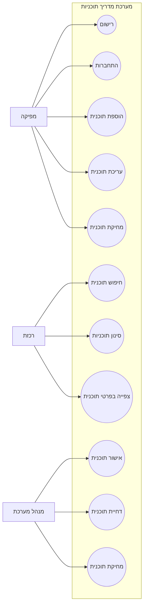

# Use Case Diagram

## גרסה מקוצרת לכיתוב מתחת לתרשים

התרשים מציג את שלושת סוגי המשתמשים המרכזיים במערכת: מפיקה, רכזת ומנהל מערכת, ואת הפעולות העיקריות שכל אחד מהם מבצע. עבור המפיקה מוצגות פעולות של רישום, התחברות, הוספה, עריכה ומחיקה של תוכניות. עבור הרכזת מוצגות פעולות של חיפוש, סינון וצפייה בפרטי תוכנית. עבור מנהל המערכת מוצגות פעולות של אישור, דחייה ומחיקה של תוכניות.

## איך להשתמש בזה ב-Word

1. לפתוח את הקובץ ב-VS Code.
2. להציג את תרשים ה-Mermaid.
3. לצלם את התרשים ולהדביק למסמך Word.
4. מתחת לתמונה להוסיף את פסקת ההסבר הקצרה שמופיעה כאן.