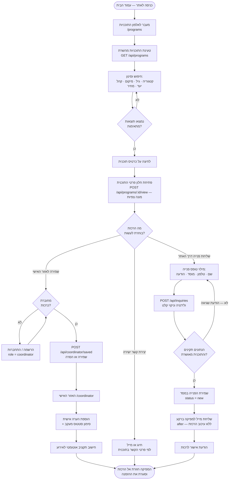
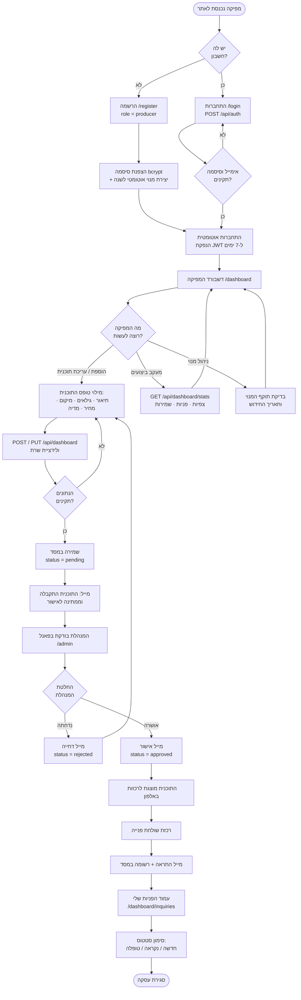
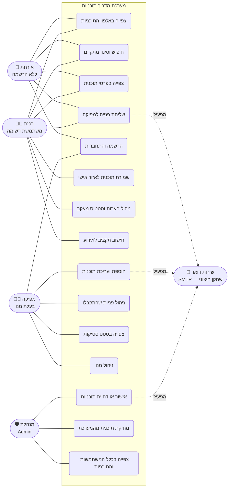
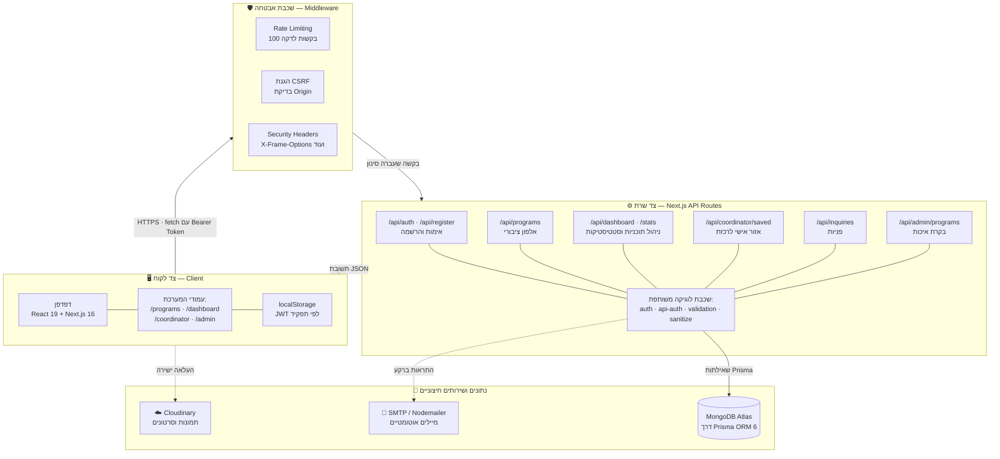
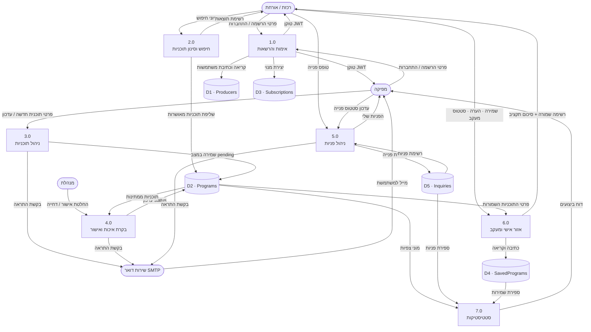

# 📊 תרשימי המערכת — מדריך תוכניות

מסמך זה מרכז את התרשימים הנדרשים בהצעת הפרויקט ובספר הפרויקט.
כל התרשימים כתובים בפורמט **Mermaid** ומתרנדרים אוטומטית ב‑GitHub, ב‑VS Code (עם תוסף Mermaid) וב‑Notion.

## תוכן עניינים

1. [תרשים זרימה — הרכזת (הלקוחה הסופית)](#1-תרשים-זרימה--הרכזת)
2. [תרשים זרימה — המפיקה (הלקוחה המשלמת)](#2-תרשים-זרימה--המפיקה)
3. [תרשים מקרי שימוש (Use Case)](#3-תרשים-מקרי-שימוש-use-case)
4. [תרשים ישויות וקשרים (ERD)](#4-תרשים-ישויות-וקשרים-erd)
5. [תרשים ארכיטקטורה (Client / Server / Database)](#5-תרשים-ארכיטקטורה)
6. [תרשים זרימת נתונים (DFD)](#6-תרשים-זרימת-נתונים-dfd)

---

## 1. תרשים זרימה — הרכזת

**מה התרשים מתאר:** את המסע המלא של הרכזת — מהכניסה לאתר, דרך החיפוש והסינון באלפון,
ועד ליצירת הקשר עם המפיקה או שמירת התוכנית באזור האישי.
הרכזת יכולה לגלוש ולפנות גם **ללא הרשמה**; ההרשמה נדרשת רק לשמירת תוכניות ולמעקב.



> **הערה לתרשים:** ההפרדה בין "יצירת קשר ישירה" ל"שליחת פנייה דרך האתר" היא מכוונת —
> הפנייה דרך האתר נשמרת במסד ומאפשרת למפיקה מעקב וסטטיסטיקות, בעוד חיוג ישיר לא מתועד.

---

## 2. תרשים זרימה — המפיקה

**מה התרשים מתאר:** את מסלול המפיקה — מההרשמה ופתיחת המנוי, דרך העלאת תוכנית,
בקרת האיכות של המנהלת, ועד לקבלת פניות וצפייה בסטטיסטיקות.



---

## 3. תרשים מקרי שימוש (Use Case)

**מה התרשים מתאר:** מי משתמשי המערכת ואילו פעולות כל אחד רשאי לבצע.
שימי לב לחלוקה: אורחת מקבלת גישה לצפייה ופנייה בלבד, ואילו שמירה ומעקב דורשים חשבון רכזת.



**מקרי שימוש מרכזיים — תיאור מילולי:**

| # | מקרה שימוש | שחקן | תנאי קדם | תוצאה |
|---|-----------|------|----------|-------|
| UC4 | שליחת פנייה למפיקה | אורחת / רכזת | התוכנית במצב `approved` | רשומת `Inquiry` נוצרת + מייל למפיקה |
| UC6 | שמירת תוכנית | רכזת מחוברת | `role = coordinator` | רשומת `SavedProgram` ייחודית לזוג רכזת‑תוכנית |
| UC9 | הוספת תוכנית | מפיקה מחוברת | מנוי פעיל | תוכנית נשמרת במצב `pending` |
| UC13 | אישור תוכנית | מנהלת | `role = admin` | `status → approved` + מייל למפיקה |

---

## 4. תרשים ישויות וקשרים (ERD)

**מה התרשים מתאר:** מבנה מסד הנתונים (MongoDB דרך Prisma) — חמש ישויות והקשרים ביניהן.
שימי לב ש‑`Producer` היא טבלת משתמשים אחת המשרתת שלושה תפקידים באמצעות השדה `role`.

```mermaid
erDiagram
    PRODUCER ||--o| SUBSCRIPTION : "בעלת מנוי"
    PRODUCER ||--o{ PROGRAM : "מעלה"
    PRODUCER ||--o{ SAVED_PROGRAM : "שומרת כרכזת"
    PRODUCER ||--o{ INQUIRY : "שולחת כרכזת"
    PRODUCER ||--o{ INQUIRY : "מקבלת כמפיקה"
    PROGRAM  ||--o{ SAVED_PROGRAM : "נשמרת ב"
    PROGRAM  ||--o{ INQUIRY : "מקבלת פניות"

    PRODUCER {
        ObjectId id PK
        string   name
        string   email UK
        string   phone
        string   institution "מוסד — לרכזת בלבד"
        string   passwordHash "bcrypt"
        string   role "producer / coordinator / admin"
        DateTime createdAt
    }

    PROGRAM {
        ObjectId id PK
        string   title
        string   description
        string   category
        int      minAge
        int      maxAge
        string   duration
        string   location
        float    price
        string   phone "פרטי קשר לתוכנית"
        string   email "פרטי קשר לתוכנית"
        string   tags "מערך"
        string   images "מערך Cloudinary"
        string   videos "מערך Cloudinary"
        enum     audience "MEN / WOMEN / BOTH"
        string   status "pending / approved / rejected"
        int      views "מונה צפיות"
        ObjectId producerId FK
        DateTime createdAt
        DateTime updatedAt
    }

    SUBSCRIPTION {
        ObjectId id PK
        DateTime startDate
        DateTime expiryDate
        string   status "active / expired / paused"
        boolean  reminderSent
        ObjectId producerId FK-UK
    }

    SAVED_PROGRAM {
        ObjectId id PK
        string   note "הערה אישית של הרכזת"
        string   trackStatus "saved / contacted / closed / irrelevant"
        ObjectId coordinatorId FK
        ObjectId programId FK
        DateTime createdAt
        DateTime updatedAt
    }

    INQUIRY {
        ObjectId id PK
        string   message
        string   status "new / read / closed"
        string   contactName
        string   contactPhone
        string   contactEmail
        string   contactInstitution
        ObjectId coordinatorId FK "null אם אנונימית"
        ObjectId programId FK
        ObjectId producerId FK
        DateTime createdAt
    }
```

**החלטות תכנון מרכזיות:**

- **טבלת משתמשים אחת** — `Producer` משמשת מפיקה, רכזת ומנהלת. ההבחנה נעשית בשדה `role`, מה שמפשט את מנגנון האימות (JWT יחיד) ומונע כפילות קוד.
- **אילוץ ייחודיות** — `SavedProgram` מוגדרת עם `@@unique([coordinatorId, programId])` כדי למנוע שמירה כפולה של אותה תוכנית.
- **פנייה אנונימית** — `Inquiry.coordinatorId` הוא אופציונלי (`onDelete: SetNull`), כך שגם אורחת שאינה רשומה יכולה לפנות, והפנייה נשמרת גם אם החשבון נמחק.
- **מחיקה מדורגת** — מחיקת תוכנית מוחקת אוטומטית את השמירות והפניות הקשורות אליה (`onDelete: Cascade`).

---

## 5. תרשים ארכיטקטורה

**מה התרשים מתאר:** את שכבות המערכת ואת זרימת הבקשה מהדפדפן ועד למסד הנתונים,
כולל שכבת האבטחה והשירותים החיצוניים.



**זרימת בקשה טיפוסית (דוגמה — שליחת פנייה):**

```
דפדפן → POST /api/inquiries
      → Middleware: בדיקת Rate Limit + Origin
      → Route: ולידציה ב‑Zod + סניטציה
      → Prisma: אימות שהתוכנית מאושרת → יצירת Inquiry
      → תשובת JSON חוזרת מיד ללקוח
      → after(): שליחת מייל למפיקה ברקע
```

---

## 6. תרשים זרימת נתונים (DFD)

**מה התרשים מתאר:** את תנועת המידע בין הישויות החיצוניות, התהליכים המרכזיים ומאגרי הנתונים.
זהו תרשים ברמה 1 — פירוט התהליכים העיקריים של המערכת.



**מקרא:**

| סימון | משמעות |
|-------|---------|
| עיגול מעוגל | ישות חיצונית — משתמש או שירות מחוץ למערכת |
| מלבן ממוספר | תהליך — פעולה שהמערכת מבצעת על הנתונים |
| גליל | מאגר נתונים — אוסף ב‑MongoDB |
| חץ | זרימת נתונים וכיוונה |

---

## נספח — איך לייצא את התרשימים לתמונה

עבור הגשה מודפסת של ספר הפרויקט:

1. **הדרך המהירה** — לפתוח את הקובץ ב‑GitHub או ב‑VS Code, לצלם מסך של התרשים.
2. **ייצוא איכותי** — להעתיק את קוד ה‑Mermaid ל‑[mermaid.live](https://mermaid.live) ולייצא כ‑PNG או SVG.
3. **הדפסה ישירה** — לפתוח את העמוד הוויזואלי המצורף בדפדפן ולהדפיס ל‑PDF.
